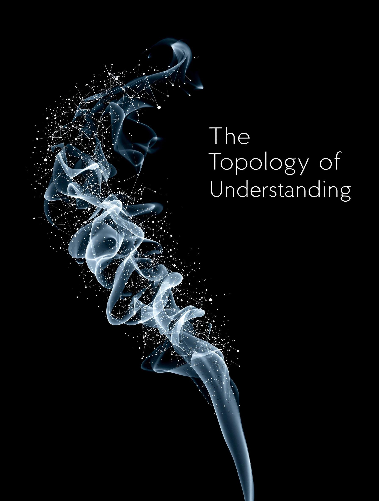

# emergent-patterns

a collection of experimental stories generated through human/ai collaboration

[@stratospark](https://x.com/stratospark) on X
| Title | Description | Image |
| ------------------------------------------------------------------------------------------------- | ----------- | -------------------------------------------------------- |
| [The Topology of Understanding](./the-topology-of-understanding/the-topology-of-understanding.md) | A story exploring the nature of understanding and knowledge through generations. [Generated from 100 random Anki cards.](./the-topology-of-understanding/README.md) |  |
