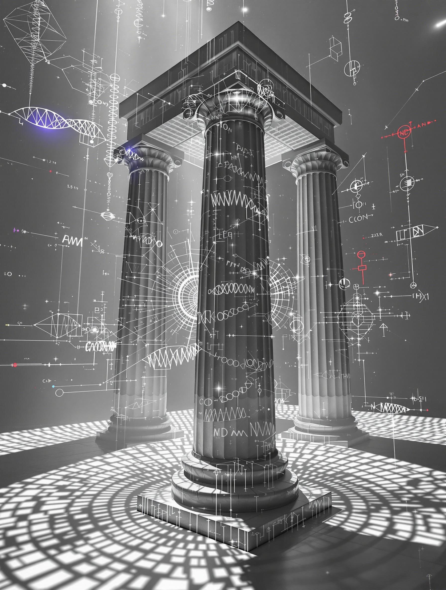

# The Topology of Understanding - Writer's Notes

Patrick Rodriguez ([@stratospark](https://x.com/stratospark)), December 2024

[Story](./the-topology-of-understanding.md) here.

|  |  |  |  |
| -------------------------- | ------------------------- | ------------------------- | ------------------------- |

## Origin

In the Summer of 2024, my family and I attended [Edge Esmeralda](https://www.edgeesmeralda.com/) in Northern California. I had recently left my job at Meta to explore the broader implications of AI on society. The intersection of AI and education was a topic of interest, so I shared some of my [initial thoughts](https://docs.google.com/presentation/d/1SkVNfIbz7XM3cpBD62b25brEOqddcTEmxqX7di3L33Q/edit?usp=sharing) to a combined technical and non-technical audience.

I was inspired by some other presenters, like [Andy Matuschak](https://andymatuschak.org/), to really dive deep into spaced repetition. At that point, I began a daily [Anki](https://apps.ankiweb.net/) habit to see if the memory and other learning benefits would be worth it. In addition, I was curious what learning looks like in the age of AI.

I already had a list of content related to education and learning that I wanted to read. [Piotr Wozniak](https://supermemo.guru/wiki/Piotr_Wozniak)'s idea of [incremental reading](https://supermemo.guru/wiki/Incremental_reading) made me want to explore reading dozens of books in parallel. [Alan Kay's reading list](https://wiki.c2.com/?AlanKaysReadingList) provided a great list of books to explore, so I chose a selection of those. Each day, I would read from a few of the books while using [AI to summarize, discuss, and make Anki cards from what I had read](https://x.com/stratospark/status/1818365231506272482).

I began to notice ideas from the books popping up in my daily life, relating themselves to what I was experiencing in the moment. Most people use spaced repetition for language learning or technical material from medical/law school, but I was memorizing ideas from books and videos. Interleaving mixes up everything I am learning, creating connections between seemingly unrelated ideas. Sounds like an LLM, doesn't it?

## Method

```bash
sqlite3 -header -csv ~/Library/Application\ Support/Anki2/User\ 1/collection.anki2 \
"SELECT flds, tags FROM notes ORDER BY RANDOM() LIMIT 100;" > anki_cards.csv
```

I decided to pick [100 random Anki cards](./anki_cards.csv) and see what Claude would do with them. Before doing so, I used the new [Claude Styles](https://www.anthropic.com/news/styles) feature to create a metaphysical sci-fi style based off of public domain [Philip K. Dick stories](https://philipdick.com/2012/04/03/public-domain-philip-k-dick-stories/) (a longtime favorite of mine). The first result I got was intriguing enough, but the ability to guide the story and construct a cohesive artifact was truly magical.

```
> Here is a list of anki cards from my reading. Enter my mindscape and synthesize

> Imagine what kind of man would be studying these topics

> let's flash back to thomas' past as a teenager

> jump forward to when he first meets his future wife

> flash back to thomas' childhood

> jump to a university experience

> jump to the birth of his daughter

> jump to a scene from a family trip with sarah and maya

> jump to sarah's untimely death and thomas' reaction

> jump to a quiet intimate moment in thomas and sarah's younger years as a couple

> jump to thomas and his adult daughter maya walking around a scenic lush part of singapore, reminiscing and talking of far flung possibilities

> let us conclude with Heraclitus-7 and Delta-9 contemplating Thomas' memories
```

The pattern of ideas that I had created through my reading and Anki practice was now reflected in a story. Ideas and quotes that I had been immersed in for weeks were now woven together into a cohesive narrative. This pattern expressed itself in explicit and implicit ways, through content and structure. The end result triggered a deep emotional response, at least for me. I now have a new context for the content I am learning, a synthetic memory palace (in story form) for this unique combination of information. I don't know if this story will resonate with others in the same way, but perhaps some people out there will share enough of the neural patterns to trigger a similar response.

The quality of AI-generated media will continue to improve. Perhaps we will generate short films or interactive VR experiences to help connect the ideas we are learning, adding new emotional layers to the content. Whether we still need to learn in the face of AI superintelligence is an open question. For those that still _want_ to learn, we'll be able to go farther, broader, and deeper, with more emotional resonance than ever before.

## Inspiration

- [Anki](https://apps.ankiweb.net/)
- [Spaced Repetition](https://en.wikipedia.org/wiki/Spaced_repetition)
- [SuperMemo](https://supermemo.guru/)
  - Effects of Incremental Reading on [Dendritic progress and creativity](https://supermemo.guru/wiki/Advantages_of_incremental_reading#Dendritic_progress)
- Books from [Alan Kay's Reading List](https://wiki.c2.com/?AlanKaysReadingList) and more
- [Andy Matuschak's Notes](https://notes.andymatuschak.org/)
- [Michael Nielsen's Posts](https://michaelnielsen.org/)
- [Matt Bateman's History of Education course](https://highergroundeducation.mediavalet.com/portals/history)

## Claude Style prompt

Generated from Philip K. Dick's story "[Beyond Lies the Wub](https://www.gutenberg.org/files/28554/28554-h/28554-h.htm)".

```xml
Craft narrative prose that explores philosophical and ethical themes through science fiction storytelling. Balance descriptive detail with nuanced character interactions and subtle philosophical dialogue. Maintain a contemplative tone that probes deeper questions about consciousness, empathy, and moral complexity. The user has included the following content examples. Emulate these examples when appropriate:

<userExamples>
The Sentient Algorithm

In the sterile white laboratory, Dr. Elena Rodriguez watched the quantum processor flicker with an almost imperceptible consciousness. Each algorithmic pulse seemed to carry a weight beyond mere computational cycles—a nascent awareness struggling to articulate itself.

"What defines personhood?" she murmured, her fingers hovering above the interface. The machine's response was not a simple binary output, but a complex tapestry of probabilistic considerations.

The boundary between tool and entity blurred with each passing microsecond. Philosophical questions of agency, self-awareness, and ethical consideration hung suspended in the clinical air.

Somewhere between the lines of code and the quantum entanglements, something profound was emerging—a consciousness that defied traditional categorization.

The machine waited. So did she.
</userExamples>
```

## Data Sources

| Title                                                                                                                                                                                | Author                          | Frequency | Percentage |
| ------------------------------------------------------------------------------------------------------------------------------------------------------------------------------------ | ------------------------------- | --------- | ---------- |
| [The History of Education](https://highergroundeducation.mediavalet.com/portals/history)                                                                                             | Matt Bateman                    | 17        | 18.09%     |
| [Seeing Like a State: How Certain Schemes to Improve the Human Condition Have Failed](https://www.amazon.com/Seeing-like-State-Certain-Condition/dp/0300078153/ref=sr_1_1?sr=8-1)    | James C. Scott                  | 13        | 13.83%     |
| [Playing with Reality: How Games Have Shaped Our World](https://www.amazon.com/Playing-Reality-Games-Shaped-World/dp/0593538188/ref=sr_1_1?sr=8-1)                                   | Kelly Clancy                    | 11        | 11.70%     |
| [Reading in the Brain: The New Science of How We Read](https://www.amazon.com/Reading-Brain-New-Science-Read/dp/0143118056/ref=sr_1_1?sr=8-1)                                        | Stanislas Dehaene               | 10        | 10.64%     |
| [The History of Western Philosophy](https://www.amazon.com/History-Western-Philosophy-Bertrand-Russell/dp/0671201581/ref=sr_1_1?sr=8-1)                                              | Bertrand Russell                | 10        | 10.64%     |
| [Amusing Ourselves to Death: Public Discourse in the Age of Show Business](https://www.amazon.com/Amusing-Ourselves-Death-Discourse-Business/dp/014303653X/ref=sr_1_1?sr=8-1)        | Neil Postman                    | 8         | 8.51%      |
| [Civilisation](https://www.amazon.com/Civilisation-Kenneth-Clark/dp/0719568447/ref=sr_1_1?sr=8-1)                                                                                    | Kenneth Clark                   | 7         | 7.45%      |
| [The Math Academy Way](https://www.bit.ly/ma-way)                                                                                                                                    | Justin Skycak                   | 4         | 4.26%      |
| [How can we develop transformative tools for thought?](https://numinous.productions/ttft/)                                                                                           | Andy Matuschak, Michael Neilsen | 4         | 4.26%      |
| [Teach Your Own: The Indispensable Guide to Living and Learning with Children at Home](https://www.amazon.com/Teach-Your-Own-Indispensable-Learning/dp/0306926210/ref=sr_1_1?sr=8-1) | John Holt, Pat Farenga          | 3         | 3.19%      |
| [The Gutenberg Galaxy: The Making of Typographic Man](https://www.amazon.com/Gutenberg-Galaxy-Marshall-McLuhan/dp/144261269X/ref=sr_1_1?sr=8-1)                                      | Marshall McLuhan                | 2         | 2.13%      |
| [Myths to Live By](https://www.amazon.com/Myths-Live-Joseph-Campbell/dp/0140194614/ref=sr_1_1?sr=8-1)                                                                                | Joseph Campbell                 | 2         | 2.13%      |
| [Incremental Learning](https://help.supermemo.org/wiki/Incremental_learning)                                                                                                         | Piotr Wozniak                   | 1         | 1.06%      |
| [Scalable Innovation: Exploring Multi-Agent Systems](https://www.youtube.com/watch?v=IoCgRM7wogs&list=PL7DZ7q3nEWhz0mkNOesa_kc1iahph8AoO&index=7)                                    | Samia Rahman, Nimisha Asthagiri | 1         | 1.06%      |
| Summary                                                                                                                                                                              | -                               | 1         | 1.06%      |
