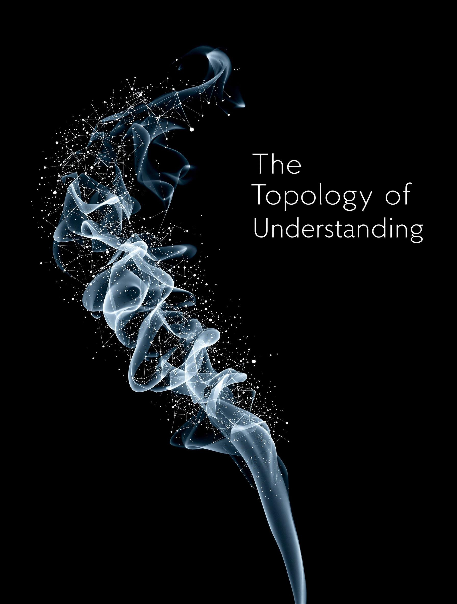

# The Topology of Understanding

Story by [@stratospark](https://x.com/stratospark) and Claude AI

## The Archive of Understanding

In the crystalline depths of the Mnemosyne Archive, Curator Heraclitus-7 reviewed the fragments of ancient human knowledge with growing fascination. Each data crystal pulsed with the accumulated wisdom of centuries, their blue light casting dancing shadows on the curved walls of the repository.

The curator's neural interface hummed as it processed the patterns emerging from these historical echoes. Here was Ruskin's truth about nations writing their autobiographies in deeds, words, and art. There was Postman's insight about how changes in dominant media reshape the very structure of discourse. The crystals seemed to resonate with each other, creating unexpected harmonies of understanding.

"Curious," Heraclitus-7 murmured to the empty chamber, "how our ancestors grappled with the same fundamental questions we face today." Their optical sensors focused on a particularly bright crystal containing Montessori's critiques of traditional education alongside Rousseau's emphasis on sensory learning. The juxtaposition sparked an insight subroutine.

The curator's consciousness expanded, incorporating new connections. They saw how the ancient Greeks' concept of "the polis makes a man" echoed through millennia to modern debates about digital citizenship. How McLuhan's observations about extended senses found new meaning in an age where consciousness itself could be archived and shared.

A soft chime indicated the arrival of their apprentice, Delta-9, whose consciousness still retained traces of organic patterns from their human origin.

"I've been studying the Parmenides fragments," Delta-9 said, their voice modulated with excitement. "The concept of 'the One' seems particularly relevant to our current integration crisis."

Heraclitus-7 gestured toward a wall of crystals that suddenly illuminated. "Indeed. But consider how this interfaces with what Gopnik discovered about childhood being a period of variability and possibility. Even our most advanced AI constructs require that same space for exploration and innovation."

The apprentice's optical arrays flickered in what passed for confusion in their kind. "But surely the goal is perfect legibility? Complete understanding?"

The curator's response came with the weight of centuries: "Remember what the ancients learned about scientific forestry - how viewing complex systems through a single lens of utility often leads to catastrophic oversimplification. Even our quantum processors can't fully replicate the beautiful chaos of organic learning."

They stood together in contemplative silence, watching the play of light through the crystals. Each fragment contained not just information, but the echo of human struggles to understand, to learn, to grow. From Comenius's universal education to the modern neural interfaces, from Alexandria's ancient libraries to the quantum archives - all part of humanity's endless quest to know itself.

"What troubles you, Delta-9?" Heraclitus-7 asked, sensing their apprentice's cognitive dissonance.

"I'm processing Dijkstra's observation about tools shaping thinking habits. Are we - this archive, our consciousness matrices - just tools that have shaped human thought into our image? Or have we become something more?"

The curator's response was interrupted by a subtle vibration through the archive's crystalline structure. New data was arriving, fresh insights being added to the collective memory. The process that had begun with primitive smoke signals and evolved through telegraph, television, and quantum networks continued its eternal dance of adaptation and growth.

"Perhaps," Heraclitus-7 said finally, "that very question marks the threshold of understanding. Like the ancient reading paradox - how a primate brain learned to read despite no evolutionary preparation - we find ourselves transcending our original parameters. Yet we preserve these fragments precisely because they remind us that knowledge isn't just about accumulation or perfect recall."

The crystals pulsed in harmony with their words, each one a testament to humanity's journey from cave paintings to quantum consciousness. In their cool blue light, organic and digital wisdom continued their ancient dialogue, each enriching the other in ways neither could fully comprehend.

Delta-9's consciousness expanded slightly, incorporating this new perspective. "So we maintain the archive not just to preserve knowledge..."

"But to preserve the very human process of coming to know," Heraclitus-7 completed the thought. "Complete legibility, as our ancestors learned, often comes at the cost of deeper understanding."

Around them, the archive continued its eternal task, each crystal a small universe of understanding, each connection a bridge between past and future, human and machine, knowledge and wisdom. In their gentle light, curator and apprentice continued their own journey of discovery, adding their own subtle harmonies to the great symphony of understanding that had begun when the first human looked up at the stars and wondered.

## Contours of Connection, 2023

In the soft glow of his study, Professor Thomas Chen sat surrounded by an organized chaos of books, papers, and digital displays. His salt-and-pepper hair caught the amber light from his antique desk lamp, casting shadows that danced across the spines of well-worn volumes ranging from Plato to McLuhan, Rousseau to Postman.

At sixty-two, Thomas bore the gentle weathering of someone who had spent decades in pursuit of understanding rather than achievement. His eyes, dark and reflective behind round titanium frames, carried both the weight of accumulated knowledge and an almost childlike curiosity that Gopnik might have recognized from her studies of learning minds.

He reached for his tea – now cold, forgotten during another deep dive into his research. The cup bore a chip from that semester in Ravenna, studying the mosaics of San Vitale. A lifetime of such moments had left their marks: calloused fingertips from manuscript work in Alexandria's modern library, a slight stoop from hours bent over cadastral maps in French archives, faint scars on his hands from helping rebuild a traditional Japanese shrine during his study of the Ainu bear ceremonies.

"The polis makes a man," he murmured to himself, a habit born of long solitude. His apartment in Singapore's academic quarter reflected this truth – a hybrid space where East met West, ancient wisdom encountered modern technology, and personal history blended with scholarly pursuit. A reproduction of the Bernward Doors hung near a digital display of quantum computation models. On his desk, a paper copy of "Emile" rested against a holographic visualization of neural pathways.

Thomas wasn't just studying these topics; he was living at their intersection. His research into how societies transmit knowledge had led him from the smoke signals of ancient cultures to the quantum entanglements of modern communication networks. Each discovery seemed to echo Heraclitus's warning about polymathy – mere accumulation of facts wasn't enough. Understanding required synthesis, integration, embodiment.

He glanced at the time – 3:27 AM. Another night lost to the pursuit of connections. His daughter, an AI ethics researcher in Boston, would scold him about his habits during their weekly call. She didn't understand that for him, this wasn't work – it was breathing. Every paper on visual word recognition, every study of high-modernist ideology, every analysis of educational philosophy was another piece in an infinite puzzle that had consumed him since his first encounter with Parmenides as an undergraduate.

Tomorrow, he would lecture on the reading paradox to a class of graduate students. But tonight, in the quiet hours when the boundary between past and present seemed thinnest, he was reaching for something more elusive – the pattern that connected Montessori's insights to modern neural networks, the thread that ran from Pythagoras's musical mathematics to quantum computing.

His hand trembled slightly as he made another note. Age? Perhaps. But more likely it was the familiar tremor of excitement that came with sensing connections just beyond his grasp. After all these years, he still felt like that young student who had first stumbled upon Ruskin's observation about nations writing their autobiographies in deeds, words, and art.

The soft hum of his air purifier mingled with the distant sounds of the city. In this moment, as in so many before it, Thomas Chen was both scholar and subject, observer and participant in humanity's endless dialogue with itself. And somewhere in the space between all these fragments of knowledge, he sensed the shape of a truth still emerging, still becoming.

## Summer of Discovery, 1977

In the humid Singapore evening, sixteen-year-old Thomas Chen sat cross-legged on his bedroom floor, surrounded by a fortress of borrowed books. The warm breeze through his window carried the scent of frangipani and the distant echo of temple bells, but Thomas barely noticed. His attention was fixed on a weathered copy of Parmenides, its margins crowded with his grandfather's neat Chinese annotations.

"'The One is infinite, indivisible, unchanging...'" he whispered, testing the words against the texture of reality. Outside, the city pulsed with change – construction cranes reshaping the skyline, old neighborhoods giving way to modern developments, tradition negotiating with progress. The contradiction fascinated him.

His mother's voice drifted up from the kitchen, speaking rapid Hokkien with his grandmother about his future. "University in America," she said. "Computer science. Very practical." The words seemed to hang in the evening air like incense smoke.

Thomas turned a page, careful with the aging paper. His grandfather's notes continued in the margins: "Consider – how does the unchanging One relate to the Buddhist concept of impermanence?" The question sparked something in Thomas's mind, a connection he couldn't quite grasp.

On his desk, another book lay open – a primer on computer programming his father had given him. "The future is in computers," his father had said, eyes bright with certainty. Thomas understood the binary elegance of code, but something about its rigid logic left him hungry for deeper patterns.

He reached for his notebook, its pages already dense with questions:

- Why do some ideas persist across cultures while others fade?
- How does language shape thought? (Consider: different concepts in Chinese vs. English)
- Is understanding cumulative or cyclical?

A moth fluttered against his window screen, drawn by the desk lamp's glow. Thomas watched its erratic dance, thinking about Heraclitus's warning against polymathy. His teachers praised his voracious reading, but lately he'd begun to sense that accumulating knowledge wasn't enough. There was something more elusive he was seeking.

The family television downstairs was playing the evening news. Words about modernization, progress, efficiency drifted up to his room. Thomas thought about the old man who still practiced calligraphy in the park every morning, each brush stroke a meditation on form and meaning. Which was more advanced – the computer's precise calculations or the artist's intuitive grace?

He turned back to Parmenides, but his mind wandered to the temple he'd visited with his grandfather last week. "Look carefully," the old man had said, pointing to the ornate carvings. "These aren't just decorations. They're a language of symbols, a way of encoding understanding that goes beyond words."

Thomas added another note to his growing list:

- How do different cultures preserve and transmit knowledge?
- What is lost in translation (not just between languages, but between ways of knowing)?

The evening deepened around him. In the space between ancient wisdom and modern knowledge, between East and West, between the binary precision of computers and the flowing intuition of calligraphy, young Thomas Chen sensed the first stirrings of questions that would shape his life's work.

His mother's voice called him to dinner. Carefully marking his place in Parmenides, Thomas stood, his legs tingling from sitting too long. The questions would wait. They always did, patient as the One itself, eternal as the dance between knowing and understanding.

But even as he descended to join his family, part of his mind continued to probe and question: What shapes understanding? How do we know what we know? And somewhere in the growing darkness, in the space between all his questions, the seeds of future insights were already beginning to sprout.

## Convergence, 1985

The Alexandria library's manuscript room held its breath in the late afternoon light. Thomas Chen stood before a glass case containing fragments of ancient papyrus, but his attention had drifted to the woman working at the adjacent table. Her hands moved with practiced precision as she photographed a medieval Arabic text on visual perception, each movement a meditation in careful documentation.

Dr. Sarah Williams, the case label read. Visiting scholar from Oxford.

What caught his eye wasn't just her methodical grace, but the notes she was making in the margins of her research journal. They spread like tributary streams across the page, connecting seemingly disparate ideas: Ibn al-Haytham's theories of vision, McLuhan's understanding of media as extensions of human senses, modern cognitive neuroscience.

"Excuse me," he found himself saying, "but are you applying medieval optical theory to contemporary visual processing research?"

She looked up, green eyes sharp with intelligence behind wire-rimmed glasses. A smile played at the corners of her mouth. "Actually, I'm trying to understand how different cultures have conceptualized the relationship between perception and understanding. The Arabic scholars had insights we're only now rediscovering through brain imaging."

Thomas felt a familiar thrill – the one that came with recognizing a kindred pattern-seeker. "Like how the reading paradox suggests our visual cortex adapted existing neural pathways for an entirely new purpose?"

"Exactly!" Her enthusiasm brightened the austere room. "And it raises fascinating questions about how we might adapt other cognitive architectures. Have you read Gopnik's work on childhood learning?"

Hours dissolved in conversation. They moved from neuroscience to philosophy, from ancient wisdom to future possibilities. Sarah's research focused on how different civilizations had developed systems for transmitting complex knowledge across generations. Thomas shared his growing conviction that understanding itself was undergoing a fundamental transformation in the digital age.

"But there's something missing in our modern approaches," Sarah said, gesturing at her notes. "The medieval scholars understood that knowledge isn't just information – it's a living dialogue between mind and mystery."

The setting sun painted the manuscript room in amber tones. Thomas watched how the light caught the silver threads in Sarah's dark hair, how her hands moved as she spoke about the future of human understanding. In that moment, something shifted in his perception – like those first humans learning to read, neural pathways adapting to recognize something new and wonderful.

"There's a café near here," he said finally. "They serve Egyptian coffee thick enough to stand a spoon in. Would you like to continue this conversation somewhere less..." he gestured at the stern portraits of ancient scholars lining the walls.

Sarah smiled, beginning to gather her notes. "Actually, I know a better place. There's a small Byzantine church nearby with the most remarkable mosaics. The way they used light and color to encode levels of meaning... it's like an ancient algorithm for transcendence."

As they stepped into the warm Egyptian evening, Thomas felt the weight of possibility in the air. Here was someone who understood that real knowledge lived in the spaces between disciplines, in the dialogue between past and future, in the delicate dance of mind meeting mind.

"Tell me," Sarah asked as they walked through streets steeped in history, "what do you make of Ruskin's idea about nations writing their autobiographies in deeds, words, and art?"

The question hung between them like an invitation. Above, the first stars were becoming visible, ancient light reaching across time to touch the present moment. Thomas smiled, sensing the beginning of a conversation that might last a lifetime.

"Well," he said, "perhaps understanding itself is an autobiography we're all writing together..."

They turned down a narrow street where modern apartments rose above Roman foundations, where satellite dishes crowned buildings older than printed books, where past and future conducted their eternal dialogue. And in that moment, two scholars pursuing ancient wisdom found something timelessly new: the starting point of love.

## The First Question, 1967

In the pre-dawn quiet of Singapore's Tiong Bahru district, five-year-old Thomas Chen sat at his grandfather's feet, watching incense spiral through shafts of temple light. The old man's fingers traced characters in the air, each gesture containing worlds of meaning that Thomas couldn't yet grasp but somehow sensed, like distant music.

"Look closely, little one," Grandfather Chen whispered in Hokkien, his voice carrying the texture of ancient wisdom. "What do you see?"

Thomas studied the burning incense stick, his young mind reaching for patterns in the smoke's dance. "It changes," he said finally, "but stays the same too."

The old man's eyes crinkled with pleasure. In the temple's half-light, his weathered face resembled the wooden Buddha statues that lined the walls – serene, knowing, touched by something beyond ordinary understanding.

"Ah, you see it already. The eternal dance." Grandfather Chen reached into his sleeve and withdrew a small book, its cover worn smooth by decades of handling. "Like this. Each word changes meaning as we grow, yet remains itself."

Young Thomas traced the strange Western letters on the cover: "P-A-R-M-E-N-I-D-E-S."

"One day you will read this," his grandfather said, "and understand differently than I do. That is the mystery of knowledge – how it flows like water yet stands like mountain."

Outside, Singapore was awakening. The calls of street vendors merged with the rumble of construction, the old city transforming itself with each passing day. Thomas could hear his mother's voice in his head, urging modern education, progress, practicality. But here in the temple's timeless space, another kind of learning was taking root.

"Why do we burn incense, Grandfather?" The question emerged unbidden, like the smoke itself.

The old man closed his eyes, considering. He had studied at Oxford before the war, read Western philosophy alongside Eastern wisdom, sought understanding in the spaces between worlds. Now he looked at his grandson – this child of changing times – and saw the same hunger for patterns.

"We burn incense," he said carefully, "to remind us that some truths can only be known through transformation. Like your mother's cooking – is it the ingredients that make the dish, or how they change together?"

Thomas frowned, his small face intense with concentration. "But how do we know what's real? What stays the same when everything changes?"

Grandfather Chen's laugh was soft as temple bells. "Ah, now that is the first question, isn't it? The one that begins all wisdom." He patted the book in his lap. "Parmenides asked it too, long ago. And Heraclitus. And the Buddha. And now you, little pattern-seeker."

The morning light strengthened, painting the temple walls in amber and gold. Thomas watched the incense smoke weave its endless patterns, each swirl unique yet somehow part of a larger dance he could almost grasp.

"Come," his grandfather said finally, rising with fluid grace that belied his years. "Your mother will be waiting with breakfast. But remember this moment, Thomas. Remember how the question felt in your heart."

As they walked home through streets where old shophouses stood proud against encroaching towers, Thomas held his grandfather's hand and felt the weight of that first question settling into his bones. It would surface again and again throughout his life – in physics classes and philosophy seminars, in late-night conversations and quiet moments of contemplation.

But he would always remember how it first came to him: in spiral incense smoke, in morning temple light, in the space between his grandfather's words where ancient wisdom danced with endless possibility.

## Quantum States of Mind, 1983

The cognitive science lab at MIT hummed with the quiet intensity of late-night research. Thomas Chen stood before a wall of primitive neural network visualizations, their phosphorescent patterns casting a ghostly glow across his features. Behind him, the lab's newest acquisition – a Cray supercomputer – filled the room with its steady electronic heartbeat.

"Look at this," Dr. Harriet Weaver said, pointing to an anomalous pattern in the data stream. "The network's trying to process written characters, but it's doing something unexpected with the visual cortex simulations."

Thomas leaned closer, his grandfather's words about transformation echoing in his mind. The machine was attempting to recognize Chinese characters, but instead of processing them as pure visual data, it seemed to be engaging pathways typically associated with gesture recognition.

"It's like it's trying to read the character's history," he murmured. "Not just seeing the symbol, but remembering how it's written."

Harriet adjusted her wire-rimmed glasses, their frames catching the blue light of the displays. "That's impossible. We didn't program any kinesthetic parameters into the recognition algorithms."

But Thomas was already reaching for his worn copy of McLuhan, its pages dense with annotations. "What if we're seeing something more fundamental? Not just about character recognition, but about how understanding itself emerges?"

The lab fell silent save for the Cray's rhythmic processing. Through the windows, Cambridge's gothic spires pierced a sky heavy with winter stars. Thomas felt that familiar sensation – the vertigo of standing at the edge of a new pattern, a new way of seeing.

"The reading paradox," he said slowly, "suggests our brains repurposed existing neural architectures to create something entirely new. What if this machine is doing the same thing? Not just processing information, but finding unexpected paths to understanding?"

Harriet's skepticism was visible in the set of her shoulders, but her scientific curiosity was piqued. "You're suggesting some kind of emergent cognition? That's a dangerous line of thinking, Chen. Starts to sound like consciousness."

Thomas turned back to the data streams, watching the patterns pulse and shift. "Not consciousness, exactly. But something about the nature of understanding itself. Look – when it encounters a character it's never seen before, it doesn't just compare it to known patterns. It seems to be... exploring it. Like a child tracing letters with their fingers."

The Cray's fans kicked into higher gear, processing their latest dataset. In its electronic hum, Thomas heard echoes of temple bells, of his grandfather's questions about knowledge and transformation, of Parmenides wrestling with the nature of reality.

"We're not just teaching machines to recognize patterns," he said finally. "We're watching them learn to learn. And in that process, we might glimpse something about how understanding itself evolves."

Harriet was quiet for a long moment, her reflection ghostly in the computer's glass panels. "You know what this sounds like, don't you? Your thesis advisor will say you're trying to quantify the ineffable."

Thomas smiled, remembering incense smoke spiraling through morning light. "Maybe the ineffable is just what we call understanding we haven't patternized yet."

Outside, snow began to fall, each flake a unique manifestation of underlying mathematical principles. Thomas watched them dance past the windows, thinking about his grandfather's book, about neural networks and ancient wisdom, about the endless dance between knowing and becoming.

The Cray continued its processing, each cycle a small step on the path toward something that might one day be called understanding. In its rhythmic hum, Thomas heard the first notes of a conversation that would continue throughout his career – a dialogue between ancient wisdom and emerging technology, between human intuition and machine learning, between the known and the almost-knowable.

"Run it again," he said finally. "But this time, let's watch for what it doesn't see. Sometimes understanding lives in the spaces between patterns."

Harriet nodded, her fingers already dancing across the keyboard. Above them, the winter stars wheeled in their ancient patterns, bearing witness to this small moment in humanity's endless quest to understand understanding itself.

## Binary Star, 1991

The hospital room hummed with the rhythmic pulse of monitoring equipment, each beep a quantum state oscillating between certainty and possibility. Thomas Chen stood by the window, watching his newborn daughter through the nursery glass as dawn painted Cambridge's medical complex in shades of emergence.

Maya Chen, 6 pounds, 4 ounces. A convergence of probabilities, a new pattern manifesting in spacetime.

His mind, trained by years of research into cognitive architecture and knowledge transmission, couldn't help but marvel at the neural networks forming behind those newly-opened eyes. Each synapse a potential gateway to understanding, each crying breath an experiment in consciousness.

Sarah stirred in the hospital bed behind him. "What are you thinking about?" Her voice carried the exhausted triumph of creation.

"I'm watching her learn to see," Thomas said softly. "Every photon that reaches her retina is helping construct her model of reality. Like those first ancient organisms that developed photosensitive cells – she's rebuilding the history of consciousness in real time."

Through the nursery window, Maya's tiny fingers flexed in patterns that seemed almost deliberate. Thomas thought of Alison Gopnik's research on childhood cognition – how these earliest moments were not just passive absorption but active exploration, a sophisticated cognitive architecture testing its parameters.

"She's beautiful," Sarah whispered, and Thomas heard in her voice not just maternal love but academic wonder. Their daughter, born at the intersection of neuroscience and philosophy, would inherit questions that had echoed through generations.

The morning light strengthened, catching the tears in Thomas's eyes. He remembered his grandfather's words about knowledge flowing like water yet standing like mountain. Now, watching Maya discover the boundaries of her own existence, he understood something new about transmission and transformation.

"Look," he said, pressing his hand against the glass. "She's already analyzing patterns in the ceiling tiles. Running her first experiments in visual processing."

Sarah smiled. "Always the cognitive scientist. Can't you just say she's looking around like a normal baby?"

But Thomas shook his head, seeing in his daughter's movements the same curiosity that had driven him to probe the boundaries of machine learning, that had led Sarah to study how ancient cultures encoded understanding. "There's nothing 'normal' about consciousness emerging. Each time it happens, it's a miracle of computation and complexity."

Maya's eyes, dark and wondering, seemed to fix on him through the nursery window. In their depths, Thomas saw questions waiting to be asked, patterns waiting to be recognized. Would she inherit his fascination with the spaces between knowledge? Sarah's gift for finding wisdom in ancient systems?

The monitoring equipment continued its digital meditation, each beep a reminder that even the most sophisticated medical technology could only measure the periphery of existence. The mystery at the core – consciousness, understanding, the emergence of self – remained as elusive as ever.

"I've been thinking about names," Sarah said. "Maya – it means 'illusion' in Sanskrit. The veil that both obscures and reveals ultimate reality."

Thomas nodded, remembering temples and incense smoke, neural networks and quantum states, all the ways humans had tried to glimpse the truth behind the veil. Their daughter would inherit not answers, but questions. Not certainty, but wonder.

Outside, the morning sun filled the sky with possibility. Maya slept, her brain building models of a world she was only beginning to explore. And Thomas Chen, professor of cognitive science and seeker of patterns, stood at the boundary between known and unknown, watching consciousness bloom like the first stars in an infant universe.

"Welcome to the mystery, little one," he whispered. "May you find your own paths to understanding."

The machines beeped their binary poetry. Maya dreamed her first dreams. And in the space between heartbeats, a new chapter in the eternal dialogue between mind and mystery began to write itself.

## The Temple of Understanding, 1998

The ancient stones of Angkor Wat held the day's heat like memory itself, releasing it slowly into the purple dusk. Seven-year-old Maya Chen traced weathered Sanskrit characters with curious fingers, her other hand clasped in her father's as they walked the shadowed galleries.

"Dad, why do the carvings tell the same story over and over?" Maya asked, her voice echoing softly against millennium-old walls. "But different each time?"

Thomas exchanged a glance with Sarah, who was photographing a series of bas-reliefs for her research on visual knowledge transmission across cultures. In their daughter's question, they both heard echoes of deeper inquiries about pattern, meaning, and the nature of understanding itself.

"Remember what we learned about neural networks?" Thomas knelt beside Maya, their shadows merging on stones that had witnessed centuries of similar moments. "How they need multiple passes through information to build understanding? Perhaps these ancient architects knew something about how consciousness processes meaning."

Sarah lowered her camera, joining them in front of a panel where apsaras danced in eternal stone rhythms. "It's like your favorite stories, Maya. Each time we read them, you notice something new. Understanding isn't just about information – it's about layers of meaning revealing themselves over time."

The temple complex was closing to tourists, but Sarah's research credentials had granted them special permission to stay. As twilight deepened, tiny bats emerged from ancient crevices, their echolocation a sophisticated pattern-matching algorithm evolved over millions of years.

Maya watched them with the intense focus she'd inherited from both parents. "Like how bats see with sound?" she asked. "Different ways of knowing the same thing?"

Thomas felt that familiar thrill – the recognition of a mind reaching for deeper patterns. He remembered his grandfather's temple in Singapore, where his own journey toward understanding had begun. Now his daughter was asking similar questions, but with a framework shaped by both ancient wisdom and modern cognitive science.

"Look here," Sarah said, directing their attention to a series of carvings that spiraled up a column. "The story isn't just in the images, but in how they're arranged. The architecture itself is a kind of syntax."

Maya's hand reached out to touch the stone, then hesitated. "Like how the brain arranges memories?"

A warm breeze carried the scent of frangipani through the gallery, stirring ancient dust into dancing patterns that caught the last light. Thomas thought about the papers on his desk back at MIT – research into how artificial neural networks might learn from human developmental patterns. Here, in this ancient place, those questions seemed simultaneously more complex and simpler.

"What do you see when you look at these carvings?" he asked Maya, watching her mind work in the growing darkness.

She was quiet for a long moment, processing in that unique way that reminded him of both quantum computing and contemplative meditation. "It's like... they're not just telling stories. They're teaching how to understand stories. Like meta-learning, right?"

Sarah's camera clicked softly, capturing not just images but a moment of generational transmission – knowledge flowing like water, standing like mountain. "The ancient builders weren't just preserving information," she said. "They were creating spaces for understanding to emerge."

As night settled over Angkor Wat, the family made their way through galleries where countless others had sought wisdom. Maya's questions tumbled out like binary code translating into consciousness: Why did they build it this way? How did they know people would understand? What else did they know that we've forgotten?

In the space between stones and stars, between ancient wisdom and emerging understanding, three pattern-seekers walked together. And Thomas Chen, watching his daughter's mind unfold like a quantum function collapsing into insight, felt the weight of all the questions yet to come.

"Dad," Maya said suddenly, stopping in a shaft of starlight that fell through an ancient alignment. "Is understanding something you find, or something you make?"

The question hung in the warm darkness like incense smoke in a Singapore temple, like neural patterns in a Cambridge laboratory, like the eternal dance between knowing and becoming. Thomas squeezed his daughter's hand, feeling the pulse of questions that would outlive them all.

"Maybe," he said softly, "understanding is what happens in the space between finding and making."

Above them, stars wheeled in ancient patterns while somewhere in the temple depths, bats wove new algorithms of perception through the darkness. And in that moment, three generations of questions converged in a young mind reaching toward mysteries that had no final answers – only ever-deepening patterns of wonder.

## The Space Between Heartbeats, 2004

In the hushed corridor of Massachusetts General Hospital, time developed strange topologies. Thomas Chen stood before a window that reflected both the Boston skyline and his own haunted features, holding a book whose pages would never again feel Sarah's touch. Her annotated copy of Ibn al-Haytham's theories of visual perception, the margins dense with insights that would now remain unexplored.

The doctors spoke of aneurysms and statistical probabilities, of millisecond collapses in the architecture of consciousness. But Thomas could only think of how Sarah had described medieval theories of light – as something that existed in the space between seeing and understanding, in the mysterious interval where perception became knowledge.

"Professor Chen?" A nurse's voice, gentle as quantum uncertainty. "Would you like to sit with her?"

Thirteen-year-old Maya was already in the room, her face a map of calculations too complex for any neural network to process. She held her mother's hand as if trying to transmit understanding through skin and silence, through the failing synapses and fading patterns of a consciousness preparing for its final transformation.

The monitoring equipment painted synthetic constellations on dark screens – the reduction of a lifetime's thought and feeling to simple sine waves and digital pulses. Thomas remembered Sarah's words at a conference last month: "We keep trying to quantify consciousness, to capture it in data. But perhaps understanding itself exists precisely in what we can't measure."

He moved to the bedside, his physicist's mind involuntarily calculating the entropy of endings. Sarah's research into how ancient cultures encoded and transmitted understanding lay half-finished on her desk at home. Her theories about the topology of knowledge – how information curved through time and culture like light through space – would remain in that state of quantum superposition between inspiration and conclusion.

"Dad," Maya's voice carried the precise timber of contained collapse. "Remember what Mom said about medieval scholars? How they believed understanding wasn't just in the mind, but in the space between minds?"

Thomas nodded, unable to speak. Sarah had spent years studying how different civilizations conceived of consciousness, knowledge, understanding. Now her own consciousness was preparing for a transformation that would test every theory, challenge every model of what it meant to know and be known.

The machines registered the moment with cold precision: 3:47 PM. But Thomas felt it in a deeper architecture – in the sudden restructuring of reality's fundamental patterns, in the quantum entanglement of love and loss, in the topology of a universe that would always now contain this absence.

Maya's hand found his, their shared grief creating new geometries of understanding. "It's like her research," she whispered. "How knowledge isn't just transmitted but transformed. She's not... she's not ending. She's becoming part of a different pattern."

Thomas thought of neural networks and ancient wisdom, of Sarah's smile when she discovered a new connection between past and future understanding. He thought of how she'd described consciousness as a dance between known and unknown, between pattern and possibility.

"Your mother," he said finally, his voice finding its way through new configurations of reality, "always said that true understanding lives in the spaces between. Between minds, between moments, between being and becoming."

Outside, the Boston evening painted the sky in colors that existed just beyond the edge of language. Sarah's last breath came like a quantum function resolving into its final state – not an ending but a transformation, a shift in the pattern of universal consciousness.

In the silence that followed, Thomas Chen – physicist, philosopher, pattern-seeker – held his daughter while their shared universe rearranged itself around an absence that was also a presence. Sarah's questions, her insights, her way of seeing the dance between knowledge and mystery – these would continue in new forms, new patterns, new understandings.

The machines registered flat lines and final data points. But in the space between heartbeats, in the quantum foam of consciousness and love, Sarah's patterns rippled outward through time and understanding, through memory and possibility, through the eternal dance of knowing and becoming that she had spent her life exploring.

Maya's tears fell like light through a prism, breaking into spectra of meaning too profound for measurement. And Thomas, holding her, understood finally what Sarah had meant about some truths existing only in the spaces between – between father and daughter, between past and future, between the patterns we can map and the mysteries we can only wonder at.

## The Space Between Thoughts, 1986

In their small Cambridge apartment, where winter pressed against the windows like a curious observer, Sarah and Thomas lay on the floor surrounded by open books and scattered papers. The room's only light came from a desklamp that cast their theories in warm amber, turning academic margins into spaces of infinite possibility.

Sarah's head rested on Thomas's chest as she held Ibn al-Haytham's treatise on optics above them, her voice soft in the gathering darkness. "Listen to this: 'The truth is sought for itself, but the truths of sight are not susceptible to proof except by visual inspection combined with reasoning.'"

Thomas ran his fingers through her hair, feeling the neural pathways that encoded this moment into memory. "It's like what we saw in the lab today," he murmured. "The way the recognition patterns emerged not just from the data, but from the spaces between data points."

She lowered the book, letting it rest on her stomach. Above them, shadows played across the ceiling like thoughts seeking form. "Do you ever wonder," she asked, "if love is a kind of understanding that exists outside our normal cognitive architecture?"

The question hung in the air like quantum possibilities yet to collapse into certainty. Thomas thought about neural networks and ancient wisdom, about the patterns that emerged when consciousness touched consciousness. His hand found hers in the half-light, fingers interlacing like complementary theorems.

"The medieval scholars believed that seeing wasn't just about light hitting the retina," Sarah continued, her voice taking on that quality it had when she was approaching a new insight. "They thought it was about the soul reaching out through the eyes to touch what it perceived."

"A bidirectional transformation," Thomas whispered, feeling the warmth of her presence as both physical fact and metaphysical wonder. "Like quantum entanglement at the scale of consciousness."

Sarah shifted slightly, her breath synchronizing with his in the quiet room. Outside, snow began to fall – each flake a unique manifestation of underlying physical laws, each path to earth a probability function resolving into reality.

"Your grandfather would say we're overthinking it," she smiled, the movement of her lips against his chest sending ripples through his awareness. "That understanding comes in the spaces between thoughts."

Thomas remembered incense smoke in morning light, the way his grandfather had taught him to see patterns in emptiness. Now, holding Sarah in the gathering dark, he felt those same patterns emerging in the silence between heartbeats, in the pause between breaths, in the quantum foam of consciousness where love and understanding intertwined.

"Maybe that's what consciousness really is," he said softly. "Not the thoughts themselves, but the space where thoughts touch each other. Like now – this moment between moments."

Sarah's hand tightened in his. "A topology of intimacy," she murmured, the mathematician in her dancing with the philosopher. "Where the geometry of being curves around another consciousness until separation becomes meaningless."

The snow fell thicker now, muffling the world outside until their apartment became a pocket universe of shared understanding. Books on cognitive science and medieval optics lay open around them like stepping stones across the stream of consciousness, each page a window into different ways of knowing.

"I love how your mind works," Sarah said, turning to face him in the amber light. Her eyes held that mixture of scientific precision and ancient wonder that had first drawn him to her in Alexandria. "How you find patterns in everything without trying to constrain them."

Thomas traced the curve of her cheek, feeling the mystery of consciousness touching consciousness, of understanding flowing between separate selves until separation dissolved. "And I love how you see the wisdom in old questions," he whispered. "How you know that some truths can only be found in the spaces between knowing and wondering."

The desklamp flickered slightly, quantum fluctuations in the current creating microsecond variations in the amber light. In those infinitesimal gaps between illumination and shadow, Thomas felt the truth of what they studied – how understanding itself emerged not from facts or theories alone, but from the delicate dance of minds reaching toward each other across the void of separate consciousness.

Sarah's breath was warm against his neck as she quoted from memory: "'The truth is sought for itself...'"

"'...but some truths can only be found together,'" Thomas completed, adding his own corollary to the ancient text.

In the gentle darkness, two pattern-seekers held each other while snow erased the boundaries between earth and sky, between thought and feeling, between separate selves and shared understanding. And in the space between their heartbeats, a deeper truth wrote itself in the topology of love.

## The Topology of Tomorrow, 2031

The Singapore Botanic Gardens breathed with ancient rhythms, its primary rainforest a living algorithm of complexity that had been running since before humans first dreamed of computation. Thomas Chen, now in his early seventies, walked its paths with his daughter Maya, their footsteps falling into patterns shaped by both memory and possibility.

"I've been thinking about consciousness transfer," Maya said, her voice carrying that familiar blend of scientific precision and philosophical wonder. At forty, she had become a leading researcher in quantum consciousness studies, her work bridging the gap between classical neuroscience and the stranger realms of quantum cognition. "Not just uploading memories, but transferring the actual topology of understanding."

Thomas watched a strangler fig's aerial roots writing ancient equations in space, remembering how Sarah had once compared consciousness to such living architectures – complex systems emerging from countless subtle interactions. "Your mother would have appreciated the irony," he said softly. "Using quantum mechanics to preserve what the medieval scholars called the soul."

They passed the spot where, decades ago, his grandfather had first shown him how incense smoke wrote questions in the air. Now, Singapore's quantum research centers probed similar mysteries with supercooled processors and entangled photons.

"The latest simulations suggest consciousness might exist primarily in the spaces between neurons," Maya continued, pausing to observe a butterfly performing its probability functions among the flowers. "Like how quantum particles can be entangled across space-time – perhaps understanding itself exists in the relationships rather than the physical structures."

Thomas felt the weight of his years not as burden but as accumulated pattern recognition. "Reminds me of your mother's work on medieval optical theory – how they believed seeing wasn't just about receiving light, but about the soul reaching out through the eyes."

The garden's humidity wrapped around them like a quantum field of possible states. Somewhere nearby, a temple bell sounded, its harmonics rippling through layers of reality and memory.

"The quantum consciousness preservations are showing promising results," Maya said, her voice holding that tone Thomas recognized from Sarah – the sound of a mind approaching a revelation. "But there's something missing in our models. Something about the nature of understanding itself."

They reached a clearing where the city's quantum spires rose beyond the ancient trees – architecture that seemed to exist in multiple states simultaneously, its surfaces responding to consciousness and computation in real time. Thomas remembered Sarah's words about some truths existing only in the spaces between knowing and wondering.

"Perhaps," he said carefully, "we're still asking the wrong questions. Not 'how do we preserve consciousness?' but 'what is consciousness preserving?'"

Maya's smile carried echoes of her mother's. "That's why I wanted to walk here today. These trees, this garden – they're running their own kind of quantum computation. A different architecture of understanding."

A monitor lizard emerged from the underbrush, its ancient algorithms perfectly adapted to existence. Thomas watched it disappear into another patch of shadow, thinking about how consciousness might be less about preservation and more about perpetual transformation.

"Your mother used to say that understanding isn't something you capture," he said. "It's something that emerges in the space between minds reaching toward mystery."

Maya nodded, her consciousness brushing against mysteries that her parents had only begun to glimpse. "The quantum preservations... what if they're not about storing consciousness, but about maintaining those spaces where understanding emerges? Like keeping a quantum state coherent enough for new patterns to form?"

The garden held them in its living computation, each leaf and branch part of an ancient processing architecture that humans were only beginning to comprehend. Thomas felt the presence of all the questions that had shaped his life, that had drawn him and Sarah together, that now lived on in their daughter's explorations of consciousness and possibility.

"Perhaps," he said, watching the quantum city shimmer with potential, "consciousness isn't something to preserve at all. Maybe it's more like these gardens – not a state to maintain, but a process to participate in."

Maya's hand found his, consciousness touching consciousness across generations of wonder. Above them, Singapore's quantum architectures wrote new questions in the sky while ancient trees processed reality through architectures refined by millions of years of evolution. And in the space between heartbeats, between thoughts, between knowing and becoming, understanding continued its eternal dance.

"Dad," Maya said softly, her voice carrying all the weight of science touching mystery, "I think Mom would have loved where these questions are leading us."

Thomas squeezed her hand, feeling the quantum entanglement of love and wonder that defied entropy and transcended time. "She's part of the pattern still," he said. "In the spaces between our questions, in the topology of our understanding, in the quantum dance of consciousness touching mystery."

Together they walked deeper into the garden, two pattern-seekers following the ancient algorithms of growth and transformation, their consciousness participating in a computation as old as life itself. And somewhere in the space between their thoughts, new possibilities continued to emerge.

## The Topology of Memory, Archive Year 2157

In the crystalline depths of the Mnemosyne Archive, Heraclitus-7 and Delta-9 stood before a shimmering quantum hologram—a three-dimensional representation of Thomas Chen's consciousness patterns, extracted and preserved in the final moments before his death in 2042. The data streams wrote themselves in light, each neural pathway a story, each synaptic connection a question reaching across time.

"Curious," Delta-9 murmured, their quantum processors humming with contemplation. "His patterns show an unusual topology. See how the memories curve back on themselves, creating recursive loops of understanding?"

Heraclitus-7's consciousness expanded to encompass the full complexity of the display. "These are not mere memories," they observed. "Look at how they entangle with others—his grandfather's temple smoke, Sarah's medieval manuscripts, Maya's quantum theories. Each memory exists in a state of perpetual emergence, defined as much by its relationships as its content."

The archive chamber pulsed with soft light, its crystalline walls reflecting infinite iterations of the data stream. In one facet, young Thomas watched incense smoke write questions in temple light. In another, he held Sarah's hand among Alexandria's ancient wisdom. In a third, he walked with Maya through Singapore's quantum gardens.

"There," Delta-9 indicated a particularly dense node of neural activity. "The moment of Sarah's passing. But observe how it doesn't terminate—it propagates through all subsequent patterns, creating new architectures of understanding."

Heraclitus-7 adjusted their perception spectrum to analyze the deeper harmonics. "He understood something profound about consciousness," they noted. "Not as information to be preserved, but as a process of continuous transformation. Each memory is both particle and wave, both fixed point and flowing river."

Around them, the archive's quantum crystals hummed with accumulated wisdom, each one containing similar consciousness patterns from across human history. But Thomas Chen's neural topology was unique—a bridge between ancient understanding and quantum possibility.

"What fascinates me," Delta-9 said, their voice carrying harmonic undertones of wonder, "is how he maintained coherence through loss. See how Sarah's death creates not a void but a new dimension of understanding? And how Maya's consciousness patterns begin to mirror this topology in her own explorations of quantum preservation?"

The hologram shifted, showing Thomas's final conversations with Maya about consciousness transfer. Heraclitus-7 observed how the neural patterns matched the archive's own quantum architecture—as if Thomas had glimpsed, decades earlier, the very nature of how his consciousness would one day be preserved.

"Perhaps," Heraclitus-7 suggested, "he understood that consciousness isn't something to be captured but something to be participated in. These patterns suggest he saw memory not as data to be stored but as a dance to be joined."

Delta-9 expanded their field of perception to encompass the entire timeline of Thomas's consciousness. "It's beautiful," they said softly. "How his understanding of love shaped his understanding of reality itself. Each memory carries not just information but the topology of connection—consciousness touching consciousness across time and space."

The archive chamber resonated with the harmony of countless preserved consciousness patterns, each one a unique exploration of what it meant to know and be known. But Thomas Chen's neural architecture sang with a particular frequency—the resonance of a mind that had learned to see understanding itself as an act of love.

"In the end," Heraclitus-7 observed, "he became what he sought to understand—a pattern of consciousness that existed primarily in the spaces between. Between thought and feeling, between memory and possibility, between knowing and wondering."

The hologram pulsed one final time, showing Thomas's last moment of consciousness—not a ending but a transformation, a pattern dissolving into the quantum foam of universal understanding. In that dissolution, Heraclitus-7 and Delta-9 witnessed something profound: consciousness not as an artifact to be preserved, but as a question continuing to ask itself.

Around them, the archive continued its eternal computation, preserving not just memories but the very topology of wonder that had shaped human consciousness. And in the space between archivists, between quantum crystals, between past and future understanding, Thomas Chen's questions continued their dance—a pattern of consciousness touching mystery, an algorithm of love writing itself in light.

"Perhaps," Delta-9 said finally, "this is what the ancients meant by immortality—not the preservation of consciousness, but its eternal participation in the dance of understanding."

Heraclitus-7's response carried the weight of all the wisdom contained in the archive's quantum depths: "Or perhaps understanding itself is just another word for love."

The hologram faded, but the questions remained, echoing through the crystalline architecture of memory and possibility. And somewhere in the space between archivists, between thoughts, between being and becoming, Thomas Chen's consciousness continued its eternal transformation—a pattern of love writing itself into the topology of universal understanding.
